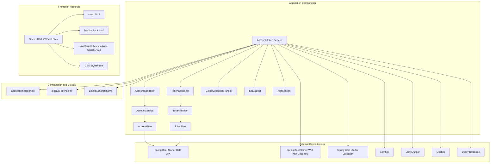
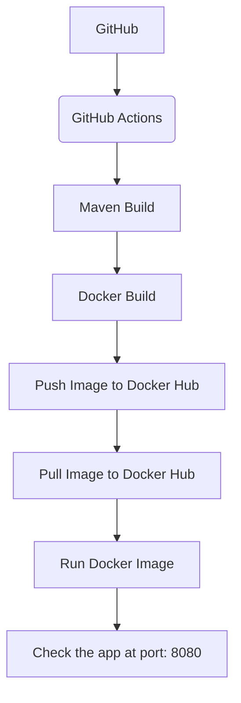
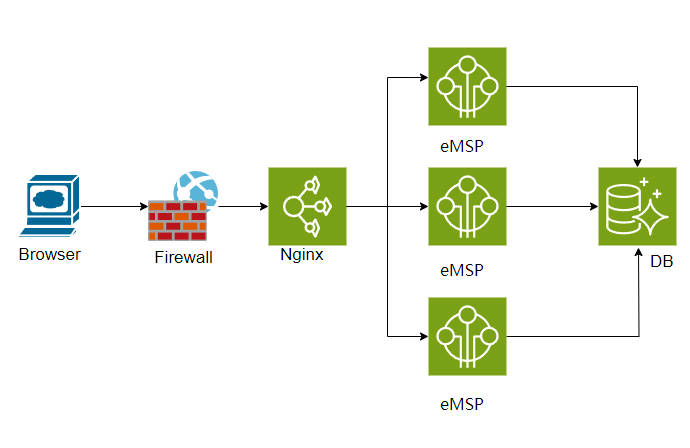
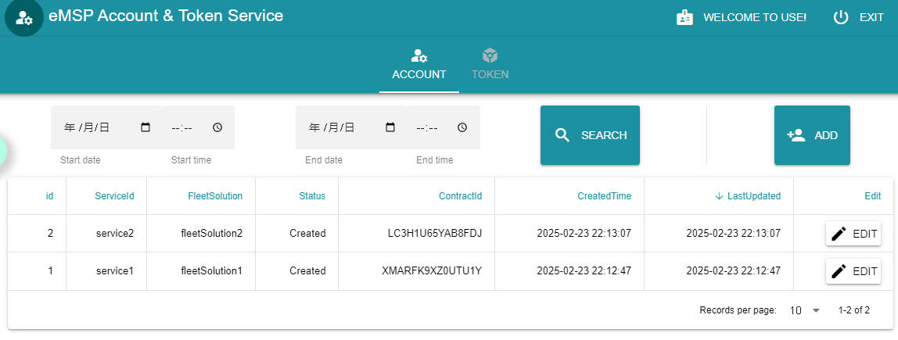

# eMSP Account & Token Service

### Architecture

### Deployment of the application

### others important files
1. [RMDB sql](assets/database%20design.sql)
2. [Integration test case](assets/integration%20tests.xlsx)
3. [Shell scripts](linuxDeployShell.sh)
4. Cloud infrastructure diagram:  

5. Azure free tier needs credit/debit card verification which only recognize Visa and MasterCard. 
    AWS free tier needs information from an enterprise, but not individual. They are all unavailable to me. 
    So I deployed it to JD Cloud.  The preview of the application : 